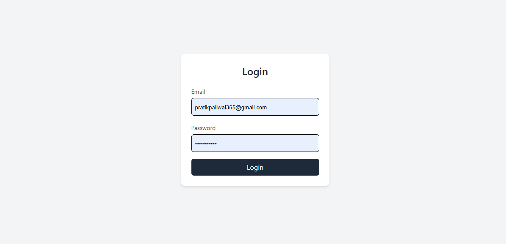
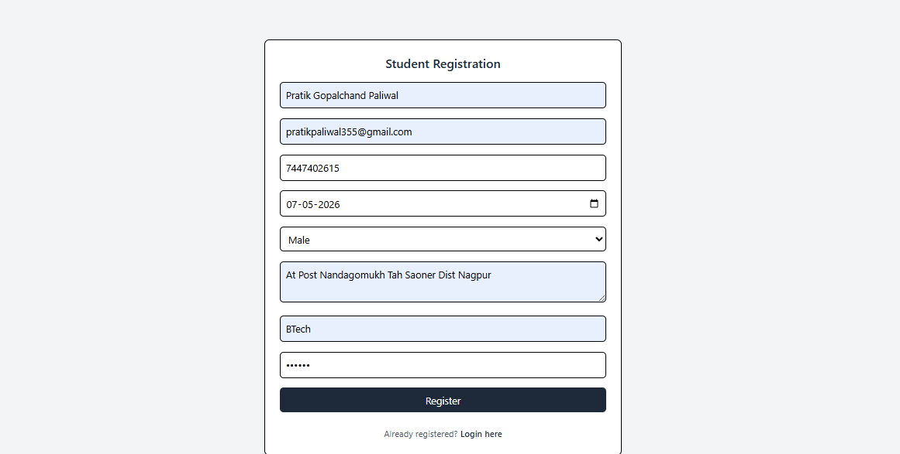
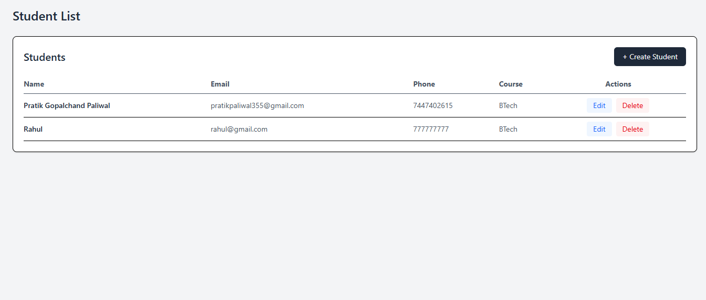

Here’s a clean, professional **README.md** for your project:

---

# 🔐 Student Management System (React + Node + TypeScript)

A full-stack **Student Registration & Login system** built using **React (TypeScript)** on the frontend and **Node.js + Express (TypeScript)** on the backend with **MongoDB**.
This project implements **2-level encryption (Frontend + Backend)** to secure user data before storage.

---

## 🚀 Features

### 👤 Authentication

* Login with Email & Password
* Email format validation
* Password strength validation

### 🎓 Student Management (CRUD)

* Create new student
* View all students
* Update student details
* Delete student record

### 🧾 Student Fields

* Full Name
* Email
* Phone Number
* Date of Birth
* Gender
* Address
* Course Enrolled
* Password

---

## 🔐 Encryption Flow (2-Level Security)

### 🔹 Level 1 (Frontend Encryption)

* Data is encrypted using **AES encryption** in `client/src/utils/crypto.ts`
* Before sending API request, all sensitive data is encrypted

### 🔹 Level 2 (Backend Encryption)

* Backend receives encrypted data
* Applies **second-layer AES encryption**
* Stores **double-encrypted data** in MongoDB

### 🔄 Decryption Flow

1. Frontend sends encrypted data → Backend
2. Backend decrypts **1st layer**
3. Backend sends data back still encrypted (2nd layer intact)
4. Frontend decrypts final layer for display

---

## 🏗️ Tech Stack

### Frontend

* React.js
* TypeScript
* Axios
* AES Encryption (CryptoJS)

### Backend

* Node.js
* Express.js
* TypeScript
* MongoDB (Mongoose)
* AES Encryption (Crypto module / CryptoJS)

---

## 📁 Project Structure

```
task-react-node-typescript/
 ┣ client/
 ┃ ┣ src/
 ┃ ┃ ┣ components/
 ┃ ┃ ┃ ┣ LoginForm.tsx
 ┃ ┃ ┃ ┣ StudentForm.tsx
 ┃ ┃ ┃ ┣ StudentList.tsx
 ┃ ┃ ┣ pages/
 ┃ ┃ ┃ ┣ LoginPage.tsx
 ┃ ┃ ┃ ┣ RegisterPage.tsx
 ┃ ┃ ┃ ┣ StudentListPage.tsx
 ┃ ┃ ┣ utils/
 ┃ ┃ ┃ ┗ crypto.ts
 ┣ server/
 ┃ ┣ src/
 ┃ ┃ ┣ routes/
 ┃ ┃ ┃ ┗ studentRoutes.ts
 ┃ ┃ ┣ controllers/
 ┃ ┃ ┃ ┗ studentController.ts
 ┃ ┃ ┣ models/
 ┃ ┃ ┃ ┗ Student.ts
 ┃ ┃ ┣ utils/
 ┃ ┃ ┃ ┗ crypto.ts
 ┃ ┃ ┣ app.ts
 ┃ ┃ ┣ server.ts
```

---

## 🔌 API Endpoints

| Method | Endpoint           | Description        |
| ------ | ------------------ | ------------------ |
| POST   | `/api/register`    | Create new student |
| GET    | `/api/students`    | Get all students   |
| PUT    | `/api/student/:id` | Update student     |
| DELETE | `/api/student/:id` | Delete student     |
| POST   | `/api/login`       | Login student      |

---

## ⚙️ Setup Instructions

### 1️⃣ Clone Repository

```bash
git clone https://github.com/PratikPaliwal509/task-react-node-typescript.git
cd task-react-node-typescript
```

---

### 2️⃣ Backend Setup

```bash
cd server
npm install
```

Create `.env` file:

```
MONGO_URI=your_mongodb_connection_string
OR 
MONGO_URI=mongodb://localhost:27017/StudentRegistration
PORT=5000
SECRET_KEY=your_SECRET_KEY
```

Run server:

```bash
npm run dev
```

---

### 3️⃣ Frontend Setup

⚠️ Update Required: In `client/src/utils/crypto.ts`, replace `FRONTEND_SECRET = "frontend_secret_key_123"` with your own secure secret key before running the project.

```bash
cd client
npm install
npm run dev
```

---

## 🔒 How Encryption Works

### Frontend (Level 1)

* Uses AES encryption before API call
* Located in:
  `client/src/utils/crypto.ts`

### Backend (Level 2)

* Receives encrypted payload
* Applies second AES encryption
* Stores double-encrypted data in MongoDB

---
## 📸 Screenshots

### 🔐 Login Page


---

### 📝 Registration Page


---

### 📋 Student List Page

---

## 👨‍💻 Author

**Pratik Paliwal**
Full Stack Developer (React + Node + TypeScript)

---
